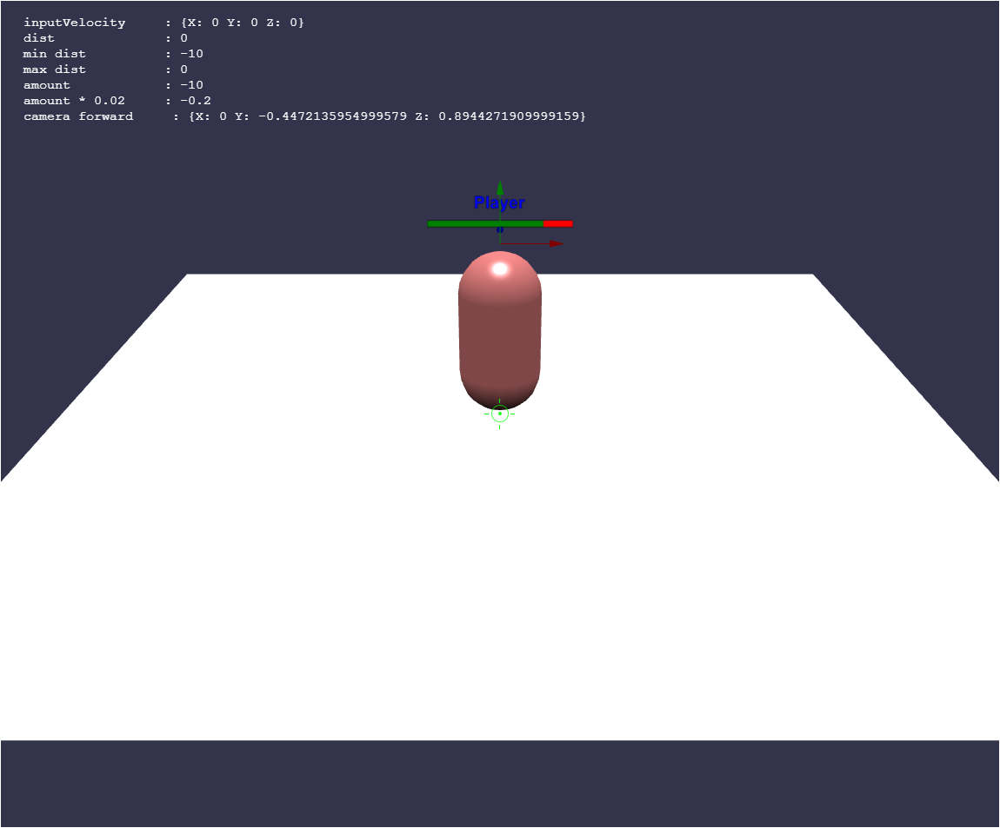

# ViteBylon

https://github.com/polymaxcube/vitebylon


## Deployment

1. Clone the repository:
```sh
git clone --branch crosshair --single-branch https://github.com/polymaxcube/vitebylon.git
```
   
2. Install
```sh
npm Install
```

3. Run
```sh
npm run dev
```
## Documentation




## License

[MIT](https://choosealicense.com/licenses/mit/)

